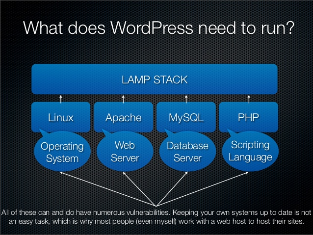
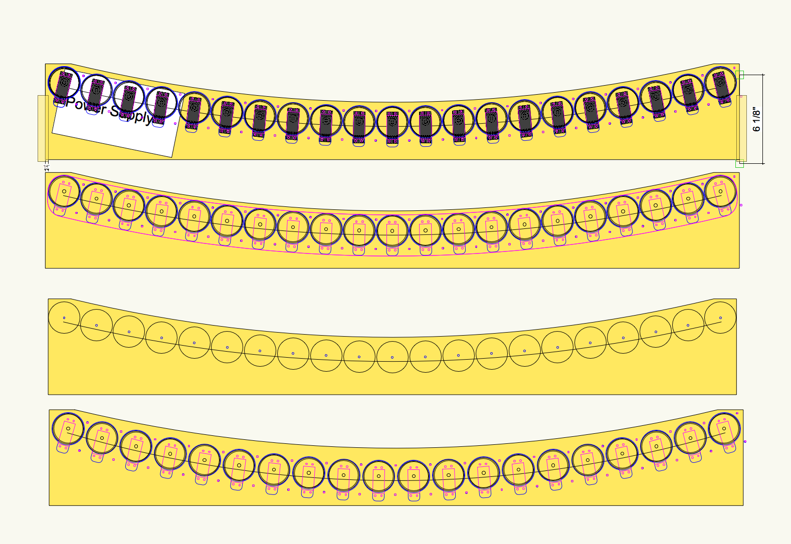
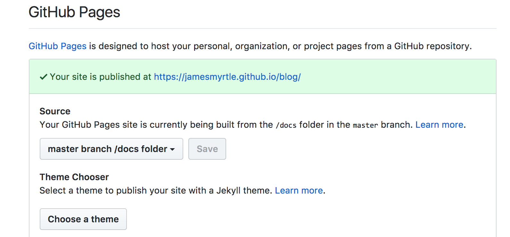
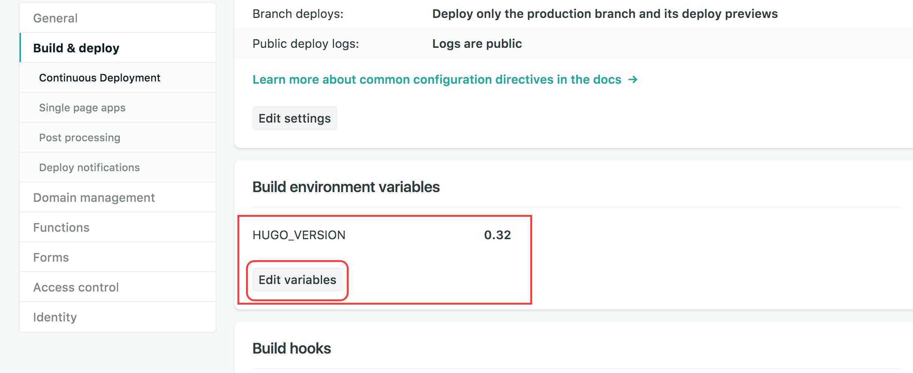
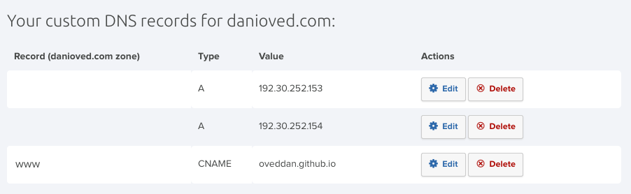

# Blog and Site Creation with **Hugo**

### by **Dan Oved** for **ITP Unconference 2018**

---

 

---

# Hugo is **A Static Site Generator**

* All content stored in git, usually on github.
* Publishing content is done through git push
* When content is published, it is served off of cdn automatically
* No reliance on database or webserver, just static html pages in the cloud
* Theme editing is just overriding html templates or css

---


---

# Lets get a Hugo site up and running

---

## Install hugo

    brew install hugo

## Verify it's installed

    hugo version
    
## Create a site:

    hugo new site blog

---

### Add a theme (https://themes.gohugo.io/)

We will use `hugo-theme-one` because it's minimal and simple

Cd into directory of blog:

    cd blog
    git init

Add the theme as a git submodule:

    git submodule add https://github.com/resugary/hugo-theme-one/ themes/one

   
---

# Configure site

Start the server:

    hugo server -D
 
Open the folder in a code editor (such as Atom)

Copy the `config.toml` from the theme's example site to the root of your app. For example: 
`cp themes/one/exampleSite/config.toml .`

---

# Content organization

```
.
└── content
    └── about
    |   └── _index.md  // <- https://example.com/about/
    ├── post
    |   ├── firstpost.md   // <- https://example.com/post/firstpost/
    |   ├── happy
    |   |   └── ness.md  // <- https://example.com/post/happy/ness/
    |   └── secondpost.md  // <- https://example.com/post/secondpost/
    └── quote
        ├── first.md       // <- https://example.com/quote/first/
        └── second.md      // <- https://example.com/quote/second/
```

---

# Create content

    hugo new posts/first-post.md

Media goes in:
`.
└──static 
    └──images 
    └──audio`

---

# Hugo 0.32 Image Processing




[View the documentation](https://gohugo.io/about/new-in-032/#image-processing)


---

# Front Matter

Attaches metadata to content

```
---
title: "spf13-vim 3.0 release and new website"
description: "spf13-vim is a cross platform distribution of vim plugins and resources for Vim."
tags: [ ".vimrc", "plugins", "spf13-vim", "vim" ]
lastmod: 2015-12-23
date: "2012-04-06"
categories:
  - "Development"
  - "VIM"
slug: "spf13-vim-3-0-release-and-new-website"
---
```

---

# Markdown In Hugo
https://daringfireball.net/projects/markdown/basics


# `#` Header 1
## `##` Header 2
### `###` Header 3

```
* Bullet 1
* Bullet 2
```
---

## Media and Links

`[example link](http://example.com/)` [example link](http://example.com/)

``



---

## Syntax Highlighting

```

  const syntax = 'highlighted';

```
---

## Hugo Shortcodes

Figure
``

Gist for https://gist.github.com/spf13/7896402
``

Instagram for https://www.instagram.com/p/BWNjjyYFxVx/
``

---

## Hugo Shortcodes (Contd.)

Tweet for https://twitter.com/spf13/status/877500564405444608
``

Vimeo for https://vimeo.com/channels/staffpicks/146022717
``

---

# Generating the site

Generate site

    hugo

Commit the changes

    git add .
    git commit -m 'created theme. added first post'

---

# Hosting - with site as subfolder

Change publish dir to docs in config.toml:

    publishDir = "docs"

Generate site and commit:

    hugo
    git add .
    git commit -m 'changed publish dir'

---

# Deploying to Github Pages

Create a repository in github, such as **blog**.  

Add repository as remote, and push:

    git remote add origin https://github.com/jamesmyrtle/blog.git
    git push origin master

---

## Deploying to Github Pages (cont.)
Configure github pages to use the docs folder

   

---

# Deploying to Netlify

Follow the [tutorial on Hugo's site](https://gohugo.io/hosting-and-deployment/hosting-on-netlify/)

**To specify the Hugo version**, in the Deploy Settings of your Netlify site:

1. Go to Build & Deploy
2. Scroll down to Build environment variables. 
3. Click `Edit Variables`
4. Enter `HUGO_VERSION` : `0.32`



---

## Deploying to Netlify
### Publishing to subfolder (such as /blog)

1. publish main site using custom domain of yourdomain.com
2. get your blog configured on a second netlify site and served under /blog (so all contents should be /blog/*)
3. set up a proxy from the first site to the second site:  https://www.netlify.com/docs/redirects/#proxying . Something like: `/blog/* https://blogsite.netlify.com/blog/:splat 200!`

---

# Configure domain

Set the A records to the IP addresses provided by github, and the CNAME to the github domain name:

  

---

# Customize Theme

Override files from the theme by creating copies in same location relative to the root

E.g. copy `themes/one/partials/header.html` to `partials/header.html`

Override css by creating a css file in static and include it in layout

E.g. create `static/css/style-custom.css`

---

# Overriding css

Know about `CSS Specificity`.  From [MDN](https://developer.mozilla.org/en-US/docs/Web/CSS/Specificity):

0. Type selectors (e.g., h1) and pseudo-elements (e.g., ::before).
1. Class selectors (e.g., .example), attributes selectors (e.g., [type="radio"]) and pseudo-classes (e.g., :hover).
2. ID selectors (e.g., #example).

(Show example in class)

---

As last resort, use `!important`:

```css
table td.fun { height: 50px; }
/* overrides the above */
table td { height: 50px !important; }
```
---

# Hugo Templates

Access a Predefined Variable
`{{ foo }}`


Call a function - parameters are separated with spaces

```go
{{ add 1 2 }}
```

Methods and fields access via Dot

`{{ .Params.bar }}`

---

# Hugo Variables

Each Hugo template is passed a `Page` as a global data object.  To access a variable off it: 
`<title>{{ .Title }}</title>`

Values can be stored and accessed later:

```go
{{ $address := "123 Main St."}}
{{ $address }}
```

---

# Context

Current context
`{{ . }}`

The context can change:

```go
{{ range array }}
    {{ . }}
{{ end }}
```

Access Global context with $.
`{{ $.Site.Title }}`

---

# Iteration
Using context:

```go
{{ range array }}
    {{ . }}
{{ end }}
```

Declaring Value => Variable Name

```go
{{range $element := array}}
    {{ $element }}
{{ end }}
```

---

# Logic

if...else if:

```go
{{ if isset .Params "alt" }}
    {{ index .Params "alt" }}
{{ else if isset .Params "caption" }}
    {{ index .Params "caption" }}
{{ end }}
```

with (if exists, and set the context):

```go
{{ with .Params.title }}<h4>{{ . }}</h4>{{ end }}
```


---

# Page-level Params

```
---
title: My First Post
date: 2017-02-20T15:26:23-06:00
categories: [one]
tags: [two,three,four]
```

Can be referenced like:
```
.Params.tags
.Params.categories
```

---

# Page Variables
Common to all pages. Some examples:

* .Content
* .Date
* .Description
* .Next (next according to publishdate)
* .NextInSection
* .WordCount

---

# Site Configuration Parameters
These are globally available.  Can be declared in `config.yaml` like:

```yaml
params:
  copyrighthtml: "Copyright &#xA9; 2017 John Doe. All Rights Reserved."
  twitteruser: "spf13"
  sidebarrecentlimit: 5
```

---

# Site Configuration Parameters (cont.)

`layouts/partials/twitter.html`:

```go
{{with .Site.Params.twitteruser}}
<div>
  <a href="https://twitter.com/{{.}}" rel="author">
  </a>
</div>
{{end}}
```

---

# Taxonomies

How related content is grouped together

`tags` and `categories` by default

`Taxonomy Templates` define the home pages for taxonomies:
* Taxonomy **List** Templates (`mysite.com/tags/pcom`)
* Taxonomy **Term** Templates (`mysite.com/tags`)

---

# Showing taxonomy for Content

Example - list tags in a page:

```
<ul id="tags">
  {{ range .Params.tags }}
    <li><a href="{{ "/tags/" | relLangURL }}{{ . | urlize }}">{{ . }}</a> </li>
  {{ end }}
</ul>
```

---

# Templates and Partial Templates

To load a template:
`{{ template "partials/header.html" . }}`

To load a partial template:
`{{ partial "header.html" . }}`

ToDo: Template lookup order

---

# Template types

* Homepage Template - `layouts/index.html`
* List Page Template - `layouts/_default/list.html`
* Single Page Template - `layouts/post/single.html`
* Section Template - `layouts/_default/section.html`
* Sitemap Template - `/layouts/sitemap.xml`
* Base Template - `/layouts/_default/baseof.html`

---

# Base Template

/layouts/_default/baseof.html

```html
<!DOCTYPE html>
<html>
  <head>
    <meta charset="utf-8">
    <title>{{ block "title" . }}
      <!-- Blocks may include default content. -->
      {{ .Site.Title }}
    {{ end }}</title>
  </head>
  <body>
    <!-- Code that all your templates share, like a header -->
    {{ block "main" . }}
      <!-- The part of the page that begins to differ between templates -->
    {{ end }}
    {{ block "footer" . }}
    <!-- More shared code, perhaps a footer but that can be overridden if need be in  -->
    {{ end }}
  </body>
</html>
```

---

# Single Page Template

layouts/post/single.html

```html

{{ define "main" }}
<section id="main">
  <h1 id="title">{{ .Title }}</h1>
  <div>
        <article id="content">
           {{ .Content }}
        </article>
  </div>
</section>
<aside id="meta">
    <div>
    <section>
      <h4 id="date"> {{ .Date.Format "Mon Jan 2, 2006" }} </h4>
      <h5 id="wordcount"> {{ .WordCount }} Words </h5>
    </section>
    {{ with .Params.tags }}
    <ul id="tags">
      {{ range . }}
        <li> <a href="{{ "tags" | absURL }}{{ . | urlize }}">{{ . }}</a> </li>
      {{ end }}
    </ul>
    {{ end }}
    </div>
    <div>
        {{ with .PrevInSection }}
          <a class="previous" href="{{.Permalink}}"> {{.Title}}</a>
        {{ end }}
        {{ with .NextInSection }}
          <a class="next" href="{{.Permalink}}"> {{.Title}}</a>
        {{ end }}
    </div>
</aside>
{{ end }}
```

---

# List Page Template

Types of list pages:
* Taxonomy terms pages
* Taxonomy list pages
* Section list pages
* RSS

layouts/_default/list.html

---

# Examples of List Page Template

```html
{{ define "main" }}
<main>
    <article>
        <header>
            <h1>{{.Title}}</h1>
        </header>
        <!-- "{{.Content}}" pulls from the markdown content of the corresponding _index.md -->
        {{.Content}}
    </article>
    <ul>
    <!-- Ranges through content/post/*.md -->
    {{ range .Data.Pages }}
        <li>
            <a href="{{.Permalink}}">{{.Date.Format "2006-01-02"}} | {{.Title}}</a>
        </li>
    {{ end }}
    </ul>
</main>
{{ end }}
```

---

# Section Page Template

More specific version of list page templates. Used for pages like `content/blog/_index.md`.

`layouts/_default/section.html`

```html
{{ define "main" }}
  <main>
      {{ .Content }}
          <ul class="contents">
          {{ range .Paginator.Pages }}
              <li>{{.Title}}
                  <div>
                    {{ partial "summary.html" . }}
                  </div>
              </li>
          {{ end }}
          </ul>
      {{ partial "pagination.html" . }}
  </main>
{{ end }}
```
