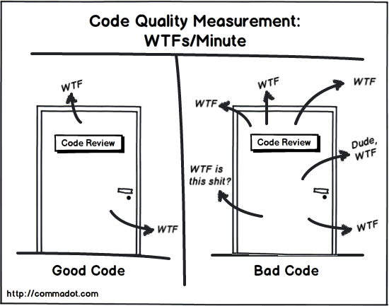

# High Quality Code and the **Dark Art of Refactoring**

### by **Dan Oved** for **ITP Unconference 2018**

---

# What

---

# Why

* Easier to Debug
* Understandable by Humans
* Resilient to Errors

---



---

# Naming conventions

All code should look like it's written by the same person

* Agree with team on casing, tabs vs spaces, etc
* Optional - use a linting tool (show demo)

---

ToDo: Insert Code Complete image

---

# Functions

## An individual method or procedure invocable for a **single purpose**

---

# Reasons to Create a Function

---

## Reduce Complexity

* hide information, and forget the details

---

## Introduce Immediate, Understandable Abstraction

```javascript
let leafName = null
if (node !== null) {
  while (node.next() !== null) {
    node = node.next()
    leafName = node.name
  }
} else {
  leafName = null
}

console.log(leafName)
```

becomes:

```javascript
const leafName = getLeafName(node)
console.log(leafName)
```

---

## Avoid Duplicate Code

## Simplify complex boolean tests

---

# Is it too small to put into a function?
Usually, no.

```javascript
const points = deviceUnits * (POINTS_PER_INCH / DeviceUnitsPerInch())
console.log(points)
```

better: 

```javascript
function deviceUnitsToPoints(deviceUnits) { 
  return deviceUnits * (POINTS_PER_INCH / DeviceUnitsPerInch())
}

const points = deviceUnitsToPoints(deviceUnits)
console.log(points)
```
---

# Good Function Names

## Describe everything the function does
If the name is too complicated, the function is probably too complicated - break it down.

## Avoid meaningless, vauge, or wishy-washy verbs
Such as *HandleCalculation()*, *PerformServices()*, *HandleOutput()*.  *FormatAndPrintOutput()* actually indicates what it is doing. 

---

# Dont differentiate functions soley based on number

## *animation1()*, *animation2()*, *animation3()* - does not say what animations do.

---

## Use opposites precisely
* begin/end
* create/destroy
* first/last
* next/previous
* get/set
* insert/delete

---

# Function Length

## Long functions have higher complexity and more prone to errors.
### As a general rule of thumb, less than 200 lines.

---

# Refactoring

Changing code without changing functionality

* Improves design of software
* Makes software easier to understand
* Helps find bugs
* Helps program faster

---

# Refactoring - When

* When add functionality
* When fixing a bug
* Before sharing code

---

# Refactoring - when to avoid

* Right before release or project is due
* When need to start over

---

# Refactoring - How

## Change one thing at a time - **Commit often**

1. Test that it works
2. Refactor
3. Test that it works
4. Commit

---

# Specific Refactorings

---

## Extract Method

You have a code fragment that can be put together:

[https://alpha.editor.p5js.org/oveddan/sketches/rkvqBo64M](https://alpha.editor.p5js.org/oveddan/sketches/rkvqBo64M)

---

## Re-assigning a local variable

When a variable is assigned to more than once and needed for a function:

[https://alpha.editor.p5js.org/oveddan/sketches/r1uk8sp4M](https://alpha.editor.p5js.org/oveddan/sketches/r1uk8sp4M)

---

## Inline Temp

You have a temp that is assigned once with a simple expression

```javascript
var center = circleCenter();
return (center > 500);
```

*Replace the temp with the expression:*

```javascript
return (circleCenter() > 500);
```

---

## Introducte Explaining Variable

You have a complicated expression.

End here!!!!

Put the result of the expression, or parts of it, in a temporary variable with an explanatory name:


