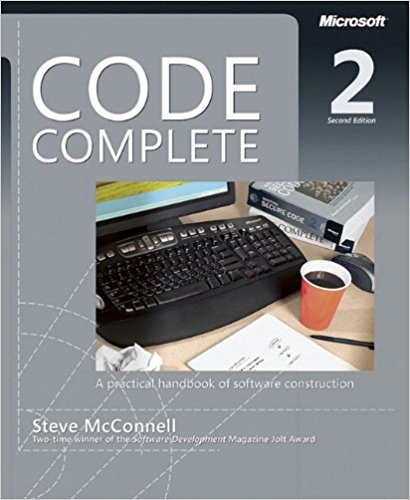
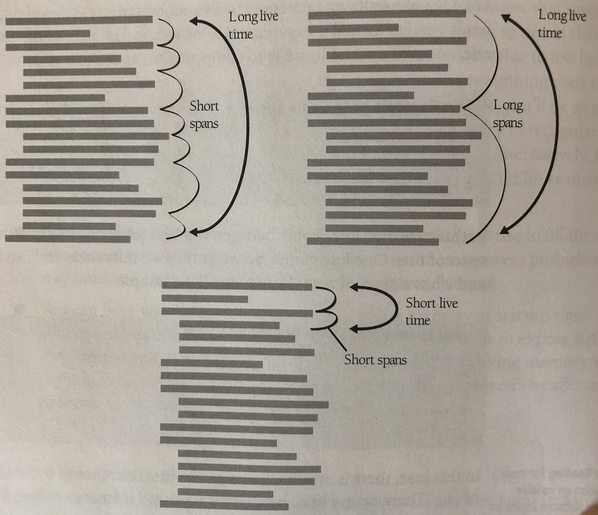
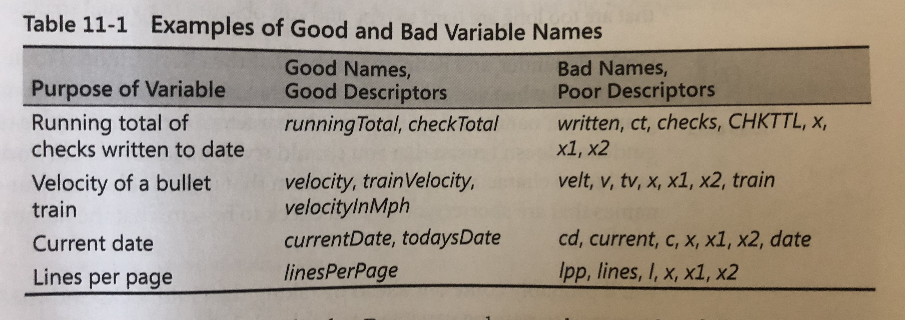
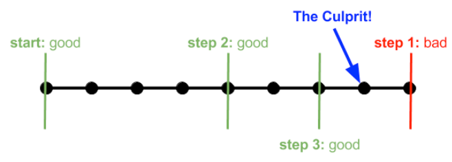

# High Quality Code and the **Dark Art of Refactoring**

### by **Dan Oved** for **ITP Unconference 2018**

---

# Creating High Quality Code



---

# Why

* Easier to Debug
* Understandable by Humans
* Resilient to Errors

---

# Goals

* Low complexity
* Focused parts with clear, singular purpose
* Low coupling (parts are independent from each other)
* Strong cohesion

---

# Some types of coupling

* Procedural - order of functions depend on each other
* Content coupling - when one module modifies or relies on the internal workings of another module
* Stamp - two modules share the same data but only use parts of it

---


---

# Composition over Inheritance

---

# Naming conventions

All code should look like it's written by the same person

* Agree with team on casing, tabs vs spaces, etc
* Optional - use a linting tool (show demo)

---

# Functions

## An individual method or procedure invocable for a **single purpose**

---

# Reasons to Create a Function

---

# Reasons to Create a Function (contd.)

## Reduce Complexity

hide information, and forget the details

---

## Introduce Immediate, Understandable Abstraction

```javascript
let leafName = null
if (node !== null) {
  while (node.next() !== null) {
    node = node.next()
    leafName = node.name
  }
} else {
  leafName = null
}

console.log(leafName)
```

becomes:

```javascript
const leafName = getLeafName(node)
console.log(leafName)
```

---

# Reasons to Create a Function (contd.)

## Avoid Duplicate Code

## Simplify complex boolean tests

---

# Is it too small to put into a function?
Usually, no.

```javascript
const points = deviceUnits * (POINTS_PER_INCH / DeviceUnitsPerInch())
console.log(points)
```

better: 

```javascript
function deviceUnitsToPoints(deviceUnits) { 
  return deviceUnits * (POINTS_PER_INCH / DeviceUnitsPerInch())
}

const points = deviceUnitsToPoints(deviceUnits)
console.log(points)
```
---

# Good Function Names

## Describe everything the function does
If the name is too complicated, the function is probably too complicated - break it down.

## Avoid meaningless, vauge, or wishy-washy verbs
Such as *HandleCalculation()*, *PerformServices()*, *HandleOutput()*.  *FormatAndPrintOutput()* actually indicates what it is doing. 

---

# Dont differentiate functions solely based on number

## *animation1()*, *animation2()*, *animation3()* - does not say what animations do.

---

## Use opposites precisely
* begin/end
* create/destroy
* first/last
* next/previous
* get/set
* insert/delete

---

## Function Length

## Long functions have higher complexity and more prone to errors.
### As a general rule of thumb, less than 200 lines.

---

# Variables

---

## Initialize each variable close to where it's first used

bad:

```javascript
let total = 0

// do a bunch of things

for (int i = 0; i < 10; i++) {
  total = total * total;
}
```

better:

```javascript
// do a bunch of things

let total = 0
for (int i = 0; i < 10; i++) {
  total = total * total;
}
```

^ Better because thorwing all the initializations together creates impressions that they are used throughout the whole routing

---

# Scope
## Where variables can be accessed or modified throughout the program.

---

## Variable Span
The number of lines between references to a variable

```javascript
let a = 0
let b = 0
let c = 0
a = b + c
```

What is the span?

Lowering the span increases readability

---

## Variable Live Time

Number of statements over where a variable is live.  This is bad:

```javascript
let recordIndex = 0
let total = 0
let done = false

...

while (recordIndex < recordCount) {
  recordIndex += 1
}

...

while (!done) {
  ...

  if (total > projectedTotal) {
    done = true
  }
}
```

---

* Keep Variables "Live" for as Short a Time as Possible
* Minimize the span



---

# How to minimize scope

* Initialize variables used in a loop immediately before the loop rather than at the beginning of the function
* Dont assign a value to a variable until just before its used
* Begin with most restricted visibility, and expand the variable's scope only if necessary

---

# Use each variable for exactly one purpose
An obvious sign of not doing this is using a `temporary` variable.

```javascript
// Compute roots of a quadratic equation
const root = [
  (-b + temp) / (2 * a),
  (-b - temp) / (2 * a)
]


// swap the roots
temp = root[0]
root[0] = root[1]
root[1] = temp
```

---

# Make sure all declared variables are used
## Unreferenced variables correlate with higher fault rates.

^ In-workshop example of using eslint to check this

---

# Variable Naming
## The name should **fully** and **accurately** describe what the entity and value represents
### Start by stating in words what it represents

---

# Names should be as specific as possible 



---

# Boolean Variables
Keep typical boolean names in mind.  Should imply true or false

* done
* error
* found
* success / ok

Bad: *status*, *sourceFile*.  Better: *statusOk*, *sourceFileAvailable*

---

# If statements

Put the normal path after the if instead of after the else

[See JSFiddle](https://jsfiddle.net/gskbck5z/)

---

https://martinfowler.com/books/refactoringBook.jpg

# Refactoring


---

## What is refactoring?

> A change made to the internal structure of software to make it easier to understand and cheaper to modify without changing its observable behavior
-- Martin Fowler

---

## Why Refactor

* It improves design of software
* Makes software easier to understand
* Helps find bugs
* Helps program faster

---

## Why is it a dark art?


---

## When to Do It

* When add functionality
* When fixing a bug
* Before sharing code
    
## When to avoid

* Right before release or project is due
* When need to start over

---

# Refactoring - How

## Change one thing at a time - **Commit often**

1. Test that it works
2. Refactor
3. Test that it works
4. Commit

---

# Specific Refactorings

---

## Extract Method

You have a code fragment that can be put together:

[https://alpha.editor.p5js.org/oveddan/sketches/rkvqBo64M](https://alpha.editor.p5js.org/oveddan/sketches/rkvqBo64M)

---

## Re-assigning a local variable

When a variable is assigned to more than once and needed for a function:

[https://alpha.editor.p5js.org/oveddan/sketches/r1uk8sp4M](https://alpha.editor.p5js.org/oveddan/sketches/r1uk8sp4M)

---

## Inline Temp

You have a temp that is assigned once with a simple expression

```javascript
var center = circleCenter();
return (center > 500);
```

*Replace the temp with the expression:*

```javascript
return (circleCenter() > 500);
```

---

## Split Temporary Variable

[You have a temporary variable that is assigned to more than once](https://codepen.io/anon/pen/vpbBxw?editors=0011)

```javascript
let temp = 2 * document.body.clientWidth * document.body.clientHeight;
// print the perimiter
console.log(temp);
temp = document.body.clientWidth * document.body.clientHeight;
// print the area
console.log(temp);
```

Make a separate temporary variable for each assignment.  The fact that it's set more than once is a sign that it has more than one responsibility.

---

## Remove Assignment to Parameters
The code assigns to a parameter

```javascript
function getDiscount(inputVal, quantity) {
  if (inputVal > 50) inputVal -= 2;
  if (quantity > 100) inputVal -= 1;

  return inputVal;
}
```

becomes

```javascript
function getDiscount(inputVal, quantity) {
  const discount = inputVal;
  if (inputVal > 50) discount -= 2;
  if (quantity > 100) discount -= 1;
  return discount;
}

```

^ Why? It is not clear that the parameter can be mofified.  It is much clearer if parameter only represents what is passed in.

---

## Replace Magic Number with Symbolic Constant

```javascript
function getPotentialEnergy(mass, height) {
  return mass * 9.81 * height
}
```

becomes

```javascript
const GRAVITY = 9.81
function getPotentialEnergy(mass, height) {
  return mass * GRAVITY * height
}
```

---

## Consolidate Conditional
You have a sequence of conditionals with the same result

```javascript
function disabilityAmount() {
  if (!senior) return 0;
  if (monthsDisabled > 12) return 0;
  if (isPartTime) return 0;
}
```

becomes

```javascript
function disabilityAmount() {
  if (isNotEligibleForDisability(senior, monthsDisabled, isPartTime)) return 0;
}
```

## Consolidate Duplicate Conditional Fragments
The same fragment of code is in all branches of a conditional expression

```javascript
if (isSpecialDeal()) {
  total = price * 0.95;
  send();
} else {
  total = price * 0.98;
  send();
}
```

Move it outside of the expression

```javascript
if (isSpecialDeal()) {
  total = price * 0.95;
} else {
  total = price * 0.98;
}
send();
```

---

## Remove Control Flag
You have a variable that is acting as a control flag for a series of boolean expressions

[Use a break or return instead (try in Codepen)](https://codepen.io/anon/pen/Rxvwbr?editors=0011)

---

## Replace Nested Conditional with Guard Clauses

```javascript
function getPayAmount() {
  let result;
  if (_isDead) result = deadAmount();
  else {
    if (_isSeparated) result = separatedAmount();
    else {
      if (_isRetired) result = retiredAmount();
      else result = normalPayAmount();
    }
  }
  return result;
}
```

Use Guard Clauses for Special Cases

```javascript
function getPayAmount() {
  if (_isDead) return deadAmount();
  if (_isSeparated) return separatedAmount();
  if (_isRetired) return retiredAmount();
}
```

^ A method has conditional behavior that does not make clear the normal path of execution

---

# Git Bisect


