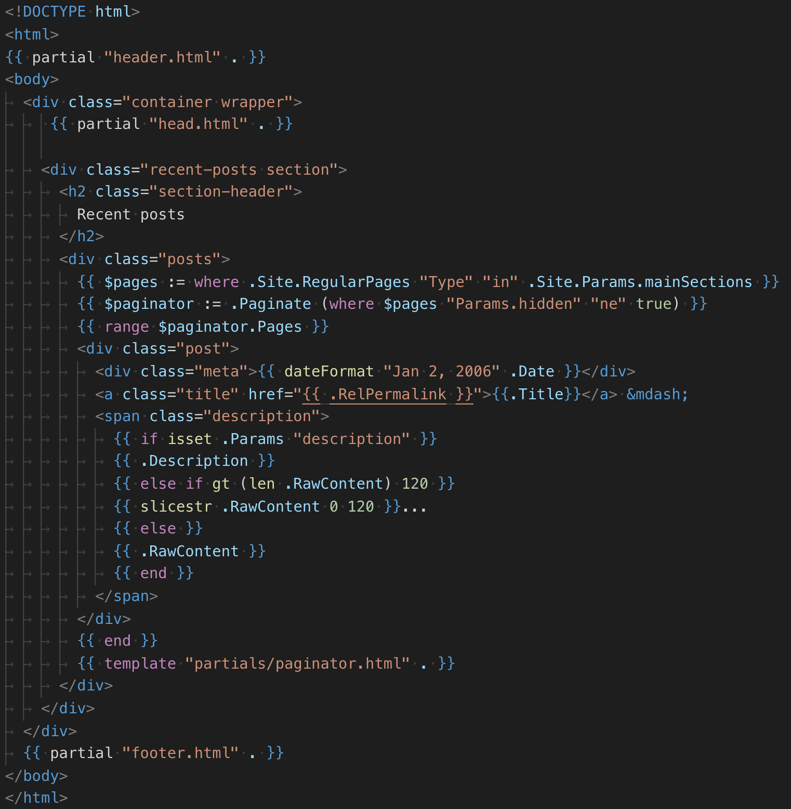
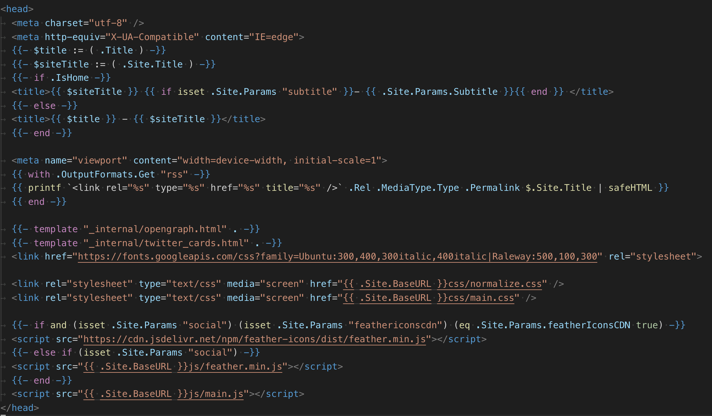
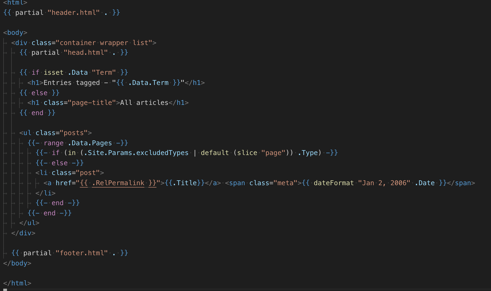

# Hugo Part 2: Customize your theme for accessibility

We'll create a blog with an existing theme, and gradually override parts of the theme:

```sh
# create hugo site
hugo new site blog 
# cd into the blog folder
cd blog
# initialize git repo
git init
# download the theme
git submodule add git@github.com:vividvilla/ezhil.git themes/ezhil
# set the theme
echo "theme='ezhil'" >> config.toml
# create a post
hugo new posts/first-post.md
```

**[Let's review the acccessibility slides from Doc Day](
https://docs.google.com/presentation/d/1BE2uIPFYJsWW6JXIR3vqq0iLzf07dKgV72SJf4iVJYw/edit?usp=sharing)** to see accessibility issues of the current theme.


## Review of Basic Html and CSS Concepts

A basic html page normally looks like:

```html
<!DOCTYPE html>
  <html>
  <!-- Generally, page metadata, css, and javascript is included in the header element -->
  <head>
    <!-- The text below appears in the title bar -->
    <title>Page Title</title>

    <!-- include some css -->
    <link href="/static/styles.css" rel="stylesheet" type="text/css">
    <!-- Include some javascript.  "Best Practices" sometimes say that the javascript should go at the end of the page, and not the header -->
    <script src='/static/main.js' type='text/javascript' ></script>
  </head>
  <body>
    <h1>A main heading</h1>
    <p>Some paragraph text</p>
    
    <h2>A sub heading</h2>
    <ul>
      <li>A list item</li>
      <li>Another list item</li>
    </ul>
    <a href="https://www.someexternalsite.com/">A link to some external site</a>
  </body>
</html>
```

## Customizing the look of the site

The simplest way customize the look of the site is to override the css of the theme - which means to write css rules that replace the existing ones of the theme. To add new css styles, while still keeping the existing styles of the site, a new css stylesheet should be included in the html of the page.

This can be done either as inline css, or as an external stylesheet:

```html
<!DOCTYPE html>
  <html>
  <head>
    <title>Page Title</title>
    <!--Theme css-->
    <link href="/static/theme.css" rel="stylesheet" type="text/css">
    <!--Custom css--> 
    <style>
      /* style overrides here: */
      h1 { color: 'black'; }
    </style>
    <!--Overrides go into the file below--> 
    <link href="/static/overrides.css" rel="stylesheet" type="text/css">
  </head>
  <body>
  </body>
</html>
```

To edit the html of a theme so that we can drop custom css in it, we need to override the html.

### Overriding html of the theme

First, let's find in this theme where the css is set, so that we can override it.

Here are the contents of the theme folder `theme/ezhil` (this can be shown by running `tree theme/ezhil`)

```sh
├── LICENSE.md
├── README.md
├── archetypes
│   └── default.md
├── exampleSite
│   ├── archetypes
│   │   └── default.md
│   ├── config.toml
│   └── content
│       ├── about.md
│       └── posts
│           ├── post-1.md
│           ├── post-2.md
│           ├── post-3.md
│           ├── post-4.md
│           ├── post-5.md
│           └── post-6.md
├── images
│   ├── screenshot.png
│   └── tn.png
├── layouts
│   ├── 404.html
│   ├── _default
│   │   ├── list.html
│   │   ├── single.html
│   │   ├── term.html
│   │   └── terms.html
│   ├── index.html
│   └── partials
│       ├── disqus.html
│       ├── footer.html
│       ├── head.html
│       ├── header.html
│       └── paginator.html
├── netlify.toml
├── static
│   ├── css
│   │   ├── main.css
│   │   └── normalize.css
│   └── js
│       ├── feather.min.js
│       └── main.js
└── theme.toml
```

The layout for the site is located at `layouts/index.html` and has contents:



When looking at this page, we see a [Go Html Template](https://golang.org/pkg/text/template/) which is a combination of html and Go Template [variables](https://gohugo.io/variables/) and [functions](https://gohugo.io/functions/) which appear within `{{}}`


Parameters for function are separated using spaces.  The general syntax is:

```
{{ FUNCTION ARG1 ARG2 .. }}
```

Notice in the html above, the header is rendered using a function `partial`:

```
{{ partial "header.html" . }}
```

which means a function is called to load the `header` [partial template.](https://gohugo.io/templates/partials/) 

> Partials are smaller, context-aware components in your list and page templates that can be used economically to keep your templating DRY.

The trailing **dot** in the function call means that the current context is passed to the partial function.  More on that later.

A `partial` is looked up in the following order:

```
1. layouts/partials/*<PARTIALNAME>.html
2. themes/<THEME>/layouts/partials/*<PARTIALNAME>.html
```

So to override the partial from the theme, we would need to create a partial called `header.html` in `/layouts/partials/header.html`

Then, below the existing stylesheets, we would add our css overrides.

### Overriding CSS

Let's [look at a basic css syntax guide](https://www.w3schools.com/css/css_syntax.asp)

Lets review how css selectors work here on the [MDN guide to CSS Selectors.](https://developer.mozilla.org/en-US/docs/Web/CSS/CSS_Selectors)

To override a css rule, we need to create another rule with more specificity.  Let's review [a guide on specifity.](https://www.w3schools.com/css/css_specificity.asp)

In class, we will override the headers and fonts to be more accessible.

## Overriding Theme Pages

### Lookup Order

To override a layout for a page, we first need to know where it is located so that it can be overrided.

Hugo searches for the layout to use for a given page in a well defined order, starting with the most specific.  Refer to the [full documentation of hugo lookup order.](https://gohugo.io/templates/lookup-order/)

The most common type of lookup for the layout is `Kind`, which is what we will concern ourselves with for this tutorial:

```
├── _default
│   ├── baseof.html
│   ├── list.html
│   └── single.html
└── index.html
```

Where `list.html` is the layout for pages that have lists of content, and `single.html` is the layout for a single page.
The folder `_default` contains the default layouts for each kind of page.

#### Section specific layouts

If you want to have specific layouts for a section of a site, it would go in the corresponding folder for a section.

For example:

```
├── _default
│   └── single.html
├── posts 
│   └── single.html
└── index.html
```

So if you had a file in `contents/posts/some-post.md` it would use the template in `posts/single.html` and `contents/about.md` - would use the file in `_default/single.html`

### Overriding theme layouts

To override a layout from a theme, place a file in the same path relative to the home directory of your site that the original file is located in.  The easiest way to start is to copy and paste that file.

So, for example, to override the `/themes/ezhil/layouts/_default/single.html` layout, copy and paste that file into `/layouts/_default/single.html`

Let's do this, and then lets modify the header to have an h2 tag instead of h1, to make the page more hierarchical.

For full reference of lookup order, [refer to the hugo documentation.](https://gohugo.io/templates/lookup-order/)

## Hugo Templating Language

Variables are accessed like:

```go
{{ .Title }}
{{ $address }}
```

A variable starting with `.` means it exists within the "current scope", and a `$` means a custom variable.

In Hugo, each template is passed a `Page` - and this becomes the "current scope".  With the Page being the default scope of a template, the `Title` element in current scope (`.` – "the **dot**") is accessible simply by the dot-prefix (`.Title`):

```html
<title>{{ .Title }}</title>
```

`Page` varaible values come from the front matter, declared at the top of each piece of content:

```
---
title: "A post about PCom"
date: 2019-09-20T10:38:33-04:00
draft: true
---
```

If we add a `className` or `summary` variable to front matter, they can be accessed consistently from the templates (let's do an in class example).


Custom variables can be declared and accessed like so:

```go
{{ $address := "123 Main St." }}
{{ $address }}
```

Let's take a look at how this is used on the `header.html` template



Let's review [some examples of logic](https://gohugo.io/templates/introduction/#logic)

With the code:

```go
{{ range $array }}
    {{ . }} <!-- The . represents an element in $array -->
{{ end }}
```

We can see how this is used in the `list.html` template:



In class together, lets edit this list template to include a bit of content from the page.

## Shortcodes

[Hugo Shortcodes](https://gohugo.io/content-management/shortcodes/) are simple snippets inside your content files that provide easily reusable functionality.

Some basic shortcodes we have already seen are:

Rendering an image in a figure element:

```go

```

Embedding an instagram post:

```go

```

Embedding a tweet:

```go

```

Embedding an instagram video:

```go

```

Embedding a youtube video:

```go

```

You can create custom shortcodes that will do a lot of repeated work for you behind the scenes.

Let's together, create a shortcode that adds an image, and resizes it automatically.

This shortcode will look like:

```go

```

#### Page Resources

Last time we showed how to include static images from the static folder.  

```
content
├── icm
│   └── an-icm-post.md
└── pcom
    ├── a-fun-post.md
    └── first-post.md
static
└── pcom
    ├── breadboard.png
    └── diagram.png
```

In the file `a-first-post.md` the file `breadboard.png` would need to be referenced like:

```

```

This is good in the beginning but has some shortcomings:

* Organization becomes a challenge, as everything is either in the `/static` folder, or needs to be organized manually to match the structure of the content to make it somewhat logically organized.
* Content needs to be referenced far away from where its used.

With [page resources,](https://gohugo.io/content-management/page-resources/) all static content needed for a particular page can be located in a folder next to the content itself:

```
content
├── icm
│   └── an-icm-post.md
└── pcom
    ├── a-fun-post
    │   ├── images
    │   │   └── breadboard.png
    │   └── index.md
    └── a-second-post
        ├── images
        │   └── diagram.png
        └── index.md
```

This would allows you to reference it locally, with a shortcode like:

```go

```

The above image tag will look for a file "image.html" in `/layouts/shortcodes` let's create thaf file `/layouts/shortcodes/image.html`

Within a shortcode, arguments can be grabbed with `.Get` and the position of the argument.  With this image shortcode, it can be grabbed and written to the page like:

```go
{{ $image:= .Get 0 }}
{{ $resize := .Get 1 }}
{{ $alt := .Get 2 }}

{{ $image }}
{{ $resize }}
{{ $alt }}
```

The path for the image resource can be found like with:

```go
{{ $original := .Page.Resources.GetMatch (printf "images/%s*" (.Get 0)) }}
```

What the above is doing is inserting the first argument into the string "images/%s*" then finding the page resource that matches that string.

Try, in the shortcode, writing:

```go
{{ printf "images/%s*" (.Get 0) }}
```

Now lets create the shortcode that renders the image with that path on the page:

```go
{{ $original := .Page.Resources.GetMatch (printf "images/%s*" (.Get 0)) }}
{{ $alt := .Get 2 }}


```

And finally, lets resize the image using the resize argument:
```go
{{ $original := .Page.Resources.GetMatch (printf "images/%s*" (.Get 0)) }}
{{ $resize := .Get 1 }}
{{ $alt := .Get 2 }}
{{ $image := $original.Resize $resize }}
<a href="{{ $original.RelPermalink }}">
  
</a>
```

For a full list of resizing options, check out [the documentation on Image Processing in Hugo.](https://gohugo.io/content-management/image-processing/#image-processing-options)

## More Links

That's it for today's tutorial.  For more great references, check out the following links:

* [Syntax Highlighting](https://gohugo.io/content-management/syntax-highlighting/)
* [Page Resources](https://gohugo.io/content-management/page-resources/) 
* [Template Lookup Order](https://gohugo.io/templates/lookup-order/)
* [Taxonomy](https://gohugo.io/content-management/taxonomies/)
* [List Page Templates](https://gohugo.io/templates/lists/)
* [Section Templates](https://gohugo.io/templates/section-templates/)


