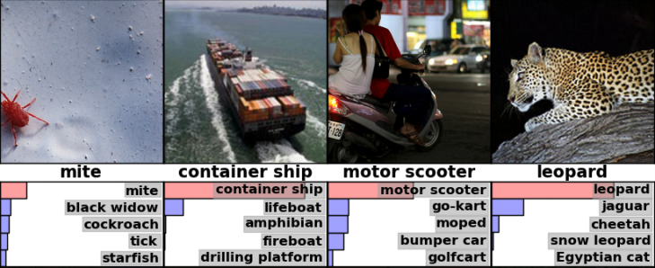

# PoseNet in Tensorflow.js

Real-Time Human Pose Estimation in the Browser with Any Webcam.

show live demo

## What is Pose Estimation?

Techniques for estimating parts of a human body.

## How has it been done?

Kinect - requires hardware, windows pc.

## OpenPose

### Convolutional Neural Network

### OpenPose 

requires complex system setup.  For real-time - CUDA capable GPU.
Show steps required to setup system.

Academic License

## PoseNet in Tensorflow.js

In javascript.
In the browser. 
Works on mobile.
Data stays private.
Apache License.

## PoseNet - a few lines of code to get it running:

Show sample code with script on the page.

## Take a step back to understand how this is possible.

Both OpenPose and PoseNet use a pre-trained machine learning model.

What does this mean?

## Example Uses

Show slides of how it's been used.

